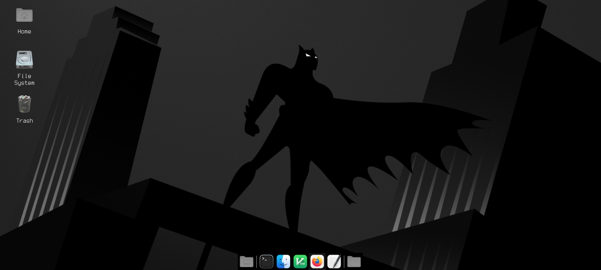
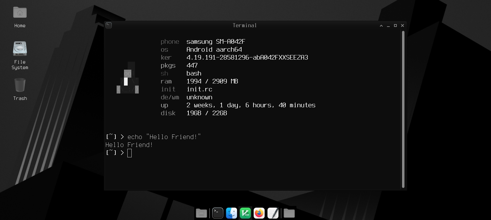
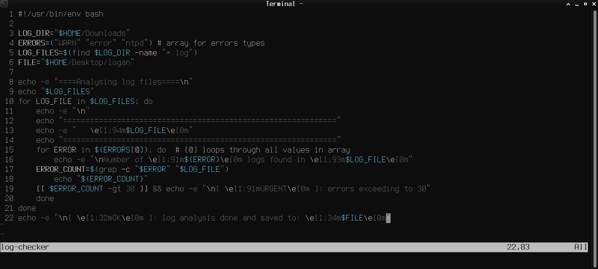
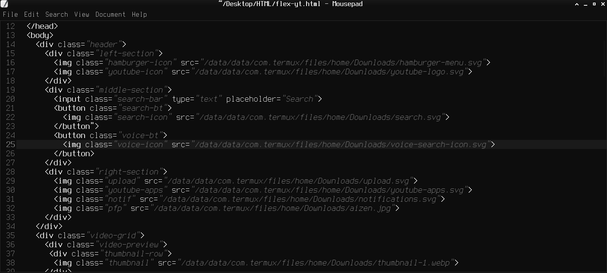

# 🌑 Noir-XFCE (Termux Edition)

A specialized, "one-click" environment installer designed to transform the **Termux-X11** XFCE desktop into a high-contrast, monochromatic workspace. Optimized for programming this suite prioritizes focus, depth and the distraction-free aesthetic.

> **Note:** Terminal and Mousepad themes must be manually selected in settings after the script runs

---

## ✨ Why Noir?
Unlike standard "dark modes" that use flat blacks, **Noir-XFCE** utilizes a sophisticated palette of deep charcoals and slate gradients. This reduces eye strain during extended terminal sessions while maintaining a sharp, atmospheric "Gotham" vibe.

---

## 📦 Components
- **GTK Theme:** Graphite-Black (Monochromatic Tweak)
- **Icon Suite:** WhiteSur-Grey-Dark
- **Typography:** Terminus (Bitmap-style for maximum legibility)
- **Editor:** Noir theme for Mousepad
- **Terminal:** Pre-configured Noir palette for `xfce4-terminal`

---

## 🚀 Installation
Ensure you are inside your Termux-X11 or VNC session before running:

1. **Clone the repository:**

```bash
git clone https://github.com/RishOnBash/noir-xfce-termux.git
cd noir-xfce-termux
```

2. **Run the installer:**

```bash
chmod +x install.sh && ./install.sh
```

3. **Restart your session (optional):**
If changes do not take effect restart your session.

---

## 📸 Visual Overview

### 🌑 Desktop


### 📟 Terminal


### 📝 Editor




---

## 🔄 Uninstallation

If you wish to revert to your original settings and remove the Noir assets, run:

```bash
chmod +x uninstall.sh && ./uninstall.sh
```

---

## 🛠️ Key Features
Automated Deployment: Uses xfconf-query to apply styles and icons instantly—no manual clicking required.
Programming Ready: Includes the Terminus font, ideal for distraction free environment.

---

## 📜 Credits & Acknowledgements
This suite simplifies the installation of several incredible open-source projects. Special thanks to:

- **GTK Theme:** [Graphite-gtk-theme](https://github.com/vinceliuice/Graphite-gtk-theme) by @vinceliuice
- **Icons:** [WhiteSur-icon-theme](https://github.com/vinceliuice/WhiteSur-icon-theme) by @vinceliuice
- **Typography:** [Codeface / Terminus](https://github.com/chrissimpkins/codeface) by @chrissimpkins
